# Metadata Standards Description Language

`slang` is a metadata langauge that allows you to describe the structure of a spreadsheet so that you can validate and extract the data from it. It can be used to interface human readable spreadsheets with automated parts of a business process or even just to extract tabular data from a spreadsheet that you have received.

`slang` takes inspiration from [CSV Schema](http://digital-preservation.github.io/csv-schema/) and [unpivotr](https://github.com/nacnudus/unpivotr) but is aimed at different users and sits in a different part of the data pipeline. The goal is to be able to describe business-domain level data with a rich, high-level [type system](https://en.wikipedia.org/wiki/Type_system), validate it and extract it from the kinds of spreadsheets that people use in their day-to-day work. After the data has been extracted it can be more easily converted to tabular, machine readable formats such as a CSV file with an associated [CSV on the Web](https://www.w3.org/TR/tabular-data-primer/) metafile or [JSON](https://www.json.org/). Because we know a lot about the [type](https://en.wikipedia.org/wiki/Data_type) of each piece of data we can start to [link](https://en.wikipedia.org/wiki/Linked_data) and [join](https://en.wikipedia.org/wiki/Join_(SQL)) it with other datasets that contain similar types in a way that would not be possible if the data was only available via a spreadsheet program.

[The git repository](https://www.github.com/alphagov/metadata-standards-description-language) contains a simple implementation of the [language](https://docs.google.com/document/d/1EVw3PkDnynfrhfg-EERQrcPbHfGGykewGmoKtGropM0) along with some demos that are described in more detail below.

## Getting Started

Check out the [git repository](https://www.github.com/alphagov/metadata-standards-description-language) and follow the instructions in the [README](https://github.com/alphagov/metadata-standards-description-language/blob/master/README) file.

Check out the [language definition](https://docs.google.com/document/d/1EVw3PkDnynfrhfg-EERQrcPbHfGGykewGmoKtGropM0) to see what you can put into `slang` metadata files.

## Demos

We started off with a simple spreadsheet that could be used by an office manager to decide which office supplies to order.

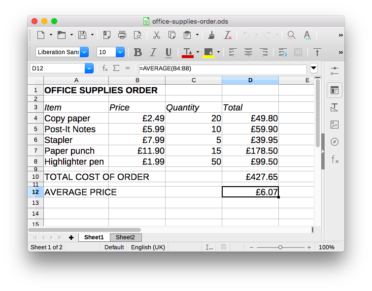

This spreadsheet contains the names of the items that need to be ordered as well as their prices and the quantities required. We don't know if the prices are inclusive or exclusive of VAT.

You can extract the data from this spreadsheet by using the supplied `slang` metadata file by invoking `make poc-json` at the command line.

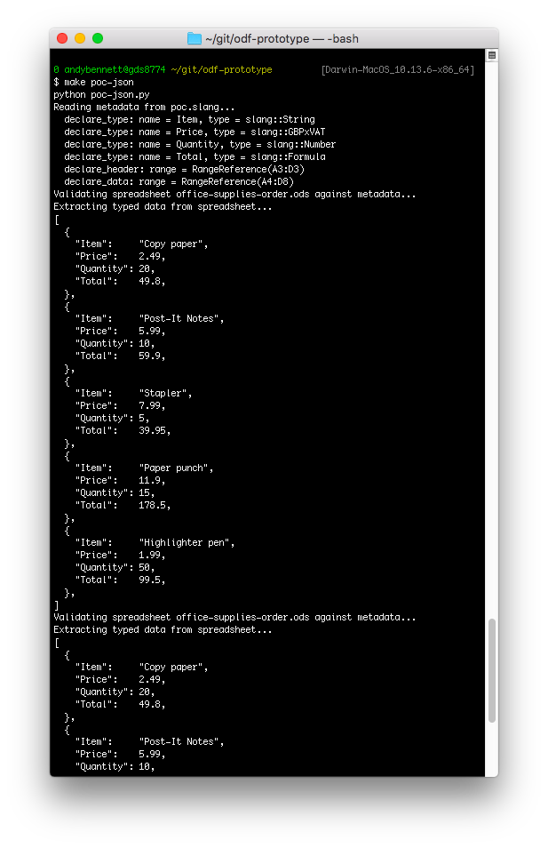

The program parses the `poc.slang` metadata file, processes the spreadsheet file and then outputs the data in JSON.

The `poc.slang` file is easy for regular users to edit because it is also a spreadsheet!

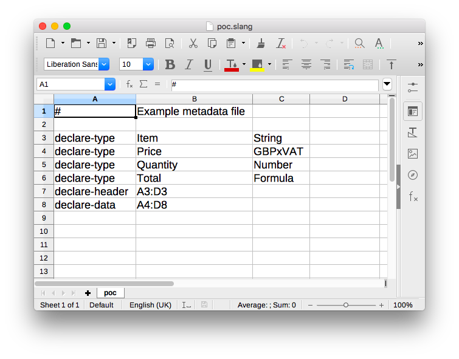

It is a simple [Tab Separated file](https://en.wikipedia.org/wiki/Tab-separated_values) that contains directives and pragmas specified in the [language definition](https://docs.google.com/document/d/1EVw3PkDnynfrhfg-EERQrcPbHfGGykewGmoKtGropM0). The user declares the data type to be used for each column (using the name of the column) as well as the location of the header row itself and, lastly, the cell range where the data exists.

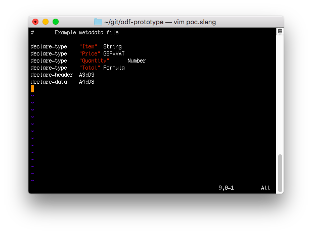

The metadata file can also be edited in a text editor.

Finally, we did some mockups of an interactive service where a user would be guided through the process of selecting the interesting parts of their spreadsheet and choosing the data types from a list. This service would build the metadata file for them based on their choices.

[Try the demo for yourself](web/out.html), or run `make render` from the `widgets/` directory to build your own copy. Once its built, open the `out.html` file that appears in the `web/` directory.

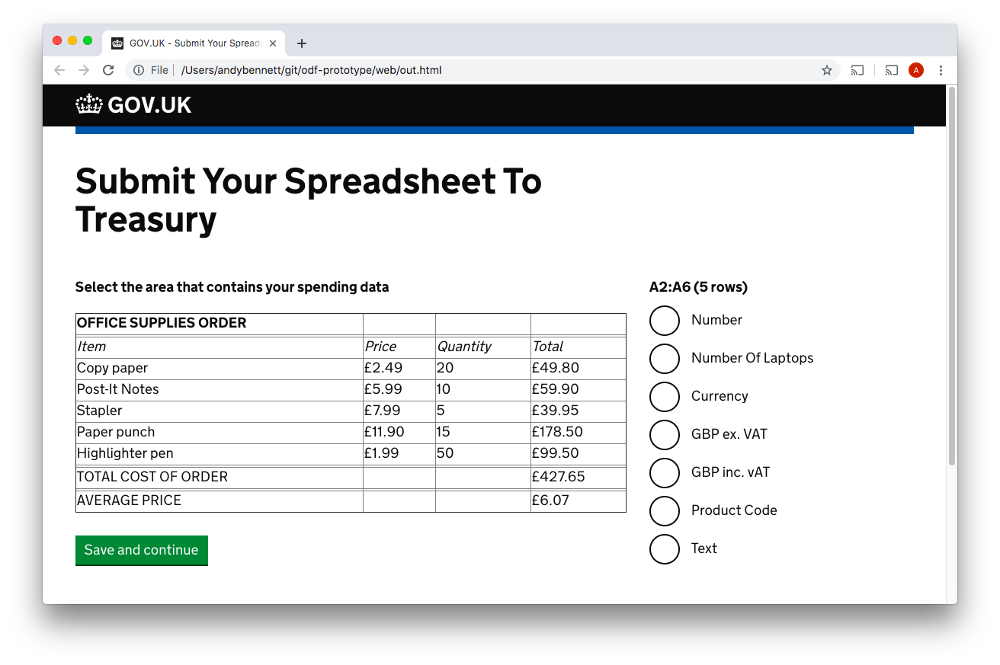
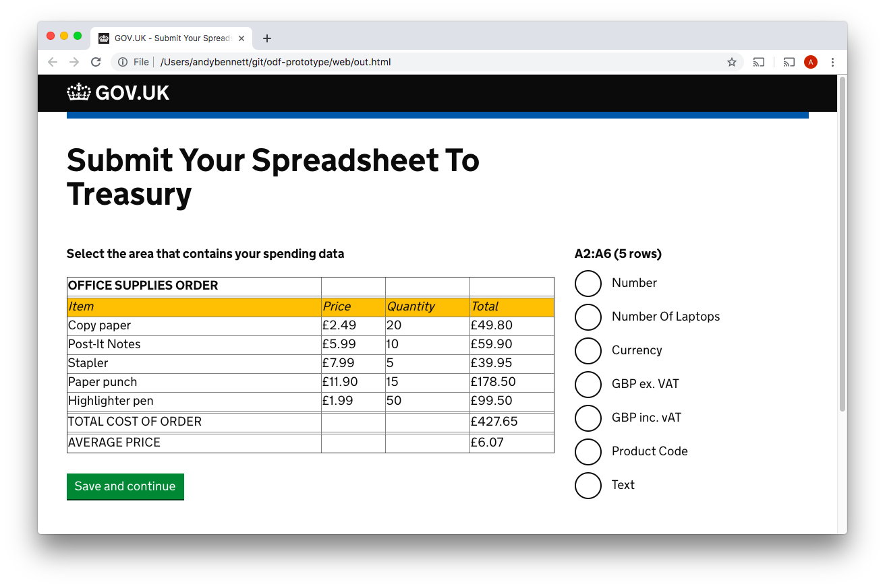

Here the user selects the header row and then clicks the "Save and continue" button. This allows the service to add the `declare-header` directive to the metadata file.

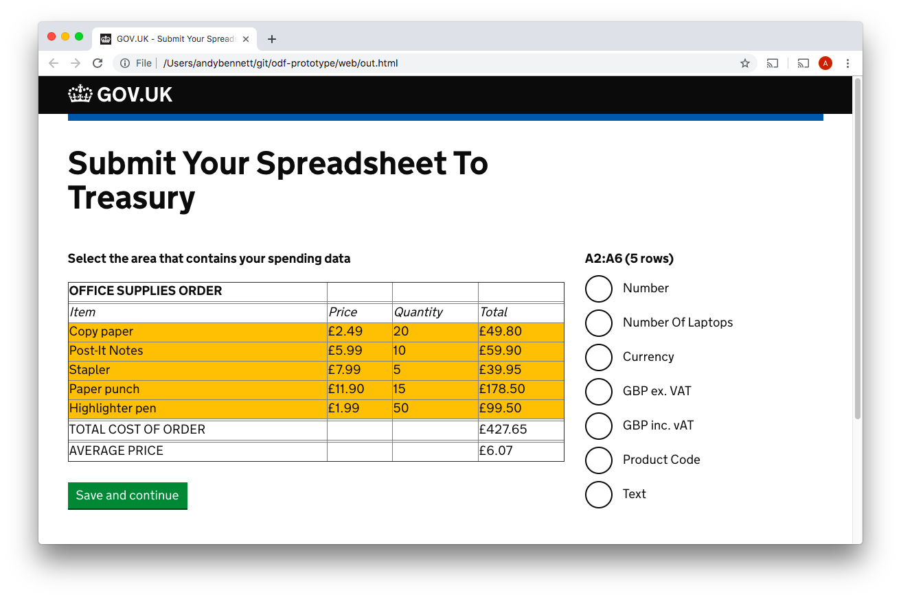

Here the user selects the cells that contain the data and then clicks the "Save and continue" button. This allows the service to add the `declare-data` directive to the metadata file.

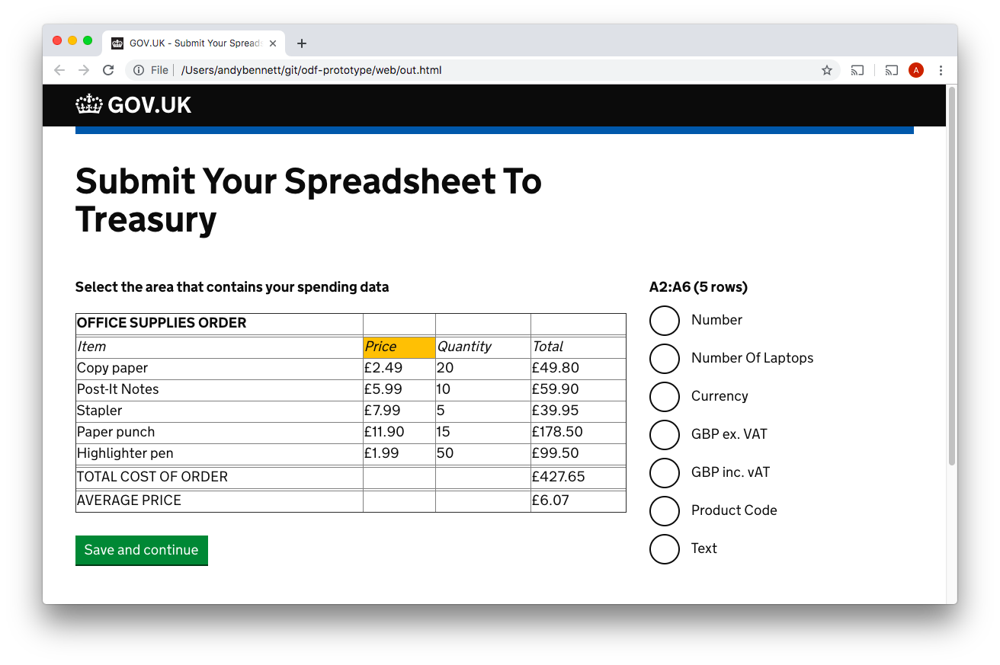

Here the user selects one of the column headers so that they can tell the service what type of data is to be found in that column.

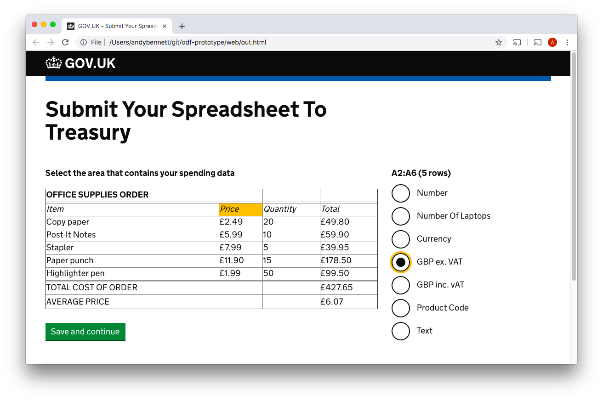

Now the user selects the type of data from the list.

When the user clicks "Save and continue" the metadata file would be produced and used by the service to automatically extract the data from their spreadsheet. The data could then be passed on for further processing rather than requiring manual processing and re-keying by a person.

## Lower Level Demo

By running `make run` from the repository's root directory you can see the [program](https://github.com/alphagov/metadata-standards-description-language/blob/bf042a84991fff20e79e7b6e1cc1226b4f1ff96f/poc.py) parsing the supplied `poc.slang` metadata file and extracting the data from the spreadsheet into a Python array.

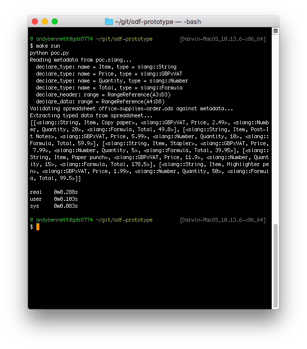

[This program](https://github.com/alphagov/metadata-standards-description-language/blob/bf042a84991fff20e79e7b6e1cc1226b4f1ff96f/poc.py) doesn't do anything with the data so can be used as a template for converting the data to your own formats. The Python classes have [pretty-printers](https://en.wikipedia.org/wiki/Prettyprint) so that you can see what the program knows about each piece of data and what it has done with it.

## Improvements

Here are some suggestions for how this program could be improved and extended.

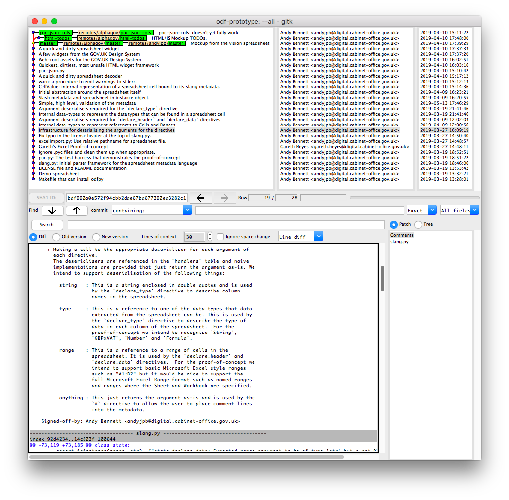

The [commit history](https://github.com/alphagov/metadata-standards-description-language/commits/master) contains the documentation you will need to understand the rationale behind the design. In the screenshot above we can see documentations about the deserialisers for each part of the metadata language itself. Each argument in `poc.slang` will be ingested by one of the `string`, `type`, `range` or `anything` deserialisers.

### Introductory Tasks

* Implement [`unescape()`](https://github.com/alphagov/metadata-standards-description-language/blob/bf042a84991fff20e79e7b6e1cc1226b4f1ff96f/slang.py#L489). The code currently assumes that the metadata does not contain any characters that need to be escaped. The escaping rules are specified in the [language definition](https://docs.google.com/document/d/1EVw3PkDnynfrhfg-EERQrcPbHfGGykewGmoKtGropM0).
* Allow `declare-type` to take a cell from the header range as its first argument, rather than the name of the header. This involves using the [cell deserialiser](https://github.com/alphagov/metadata-standards-description-language/blob/bf042a84991fff20e79e7b6e1cc1226b4f1ff96f/slang.py#L529) and writing another deserialiser that wraps [string](https://github.com/alphagov/metadata-standards-description-language/blob/bf042a84991fff20e79e7b6e1cc1226b4f1ff96f/slang.py#L495) and [cell](https://github.com/alphagov/metadata-standards-description-language/blob/bf042a84991fff20e79e7b6e1cc1226b4f1ff96f/slang.py#L529). This deserialiser can be substituted at the appropriate place in the `handlers` table.
* Do something with named ranges. We currently deserialise them and then immediatetly throw an execption as we don't yet know how to resolve them against the spreadsheet.
* Make [`poc-json-cols`](https://github.com/alphagov/metadata-standards-description-language/blob/poc-json-cols/poc-json-cols.py) work. The [`poc-json-cols` branch](https://github.com/alphagov/metadata-standards-description-language/tree/poc-json-cols) contains a demo with a spreadsheet arranged in columns rather than rows. The existing code was written with this in mind but it doesn't produce the expected result.
* Support the concatenation of multiple metadata files into a complete file so that different parts of the metadata can be specified or overridden by the sender and receiver of the spreadsheet. The [language definition](https://docs.google.com/document/d/1EVw3PkDnynfrhfg-EERQrcPbHfGGykewGmoKtGropM0) contains information about how the directives behave when the metadata is split into multiple parts.
* Write some command line tools that take the metadata file(s) and spreadsheet(s) as arguments.
* Support reading the metadata from the a sheet within the spreadsheet file. The [language definition](https://docs.google.com/document/d/1EVw3PkDnynfrhfg-EERQrcPbHfGGykewGmoKtGropM0) defines a way to serialise the metadata into the same spreadsheet file that contains the data. Implementing this will involve a refactor of the `slang` class. It's constructor currently takes a file descriptor that it expects to read lines from. The `deserialise()` should be reusable but the new stream format will need its own implementation of `unescape()` and `parse()`.

### Bigger Things
* Pivot Tables. We currently only extract simple tables. Extend the language to be able to declare both column and row headings and then write an implementation that can do the appropriate regroupings.
* Types
  * The existing type system is rather symbolic. `class Type` needs an interface and the existing types need validators and extractors. An [intermediate format](https://github.com/alphagov/metadata-standards-description-language/commit/1a0ce4a76c47c93f3cf3b5aa43d4e5867afdad3) needs to be defined and implemented so that the slang types are automatically defined across all spreadsheet formats.
  * Implement validators for String, Number, Formula and GBPxVAT.
  * Add some more types.
  * Define a governance process for discovering and agreeing types.
  * Draw the list of types and their associated validators and extractors from an authenticated, external data source so that the definitions can be easily updated in the field.

* [Improve the web demo](https://github.com/alphagov/metadata-standards-description-language/commit/2bc25a61f15d82512f50dc546bfbcbfeca6eefb4).
* Add logic to the web demo that walks the user through the process step-by-step.
* Add a `textarea` to the web demo that builds up the contents of the metadata file as the user moves through the process.

### Extending the Language
* Implementing `declare-context`. This directive is specified in the [language definition](https://docs.google.com/document/d/1EVw3PkDnynfrhfg-EERQrcPbHfGGykewGmoKtGropM0) but doesn't currently have an implementation or any guidance on what to do with the information.
  * `declare-context` requires the directive deserialiser to support dependently-types arguments. This is because the type of the third argument changes depending on which field is specified in the second argument. [This](http://wiki.call-cc.org/eggref/4/email-address) might be useful when implementing the eMail address parser for the `doc-creator` field.

There are plenty more directions that you could take the language and implementation.

